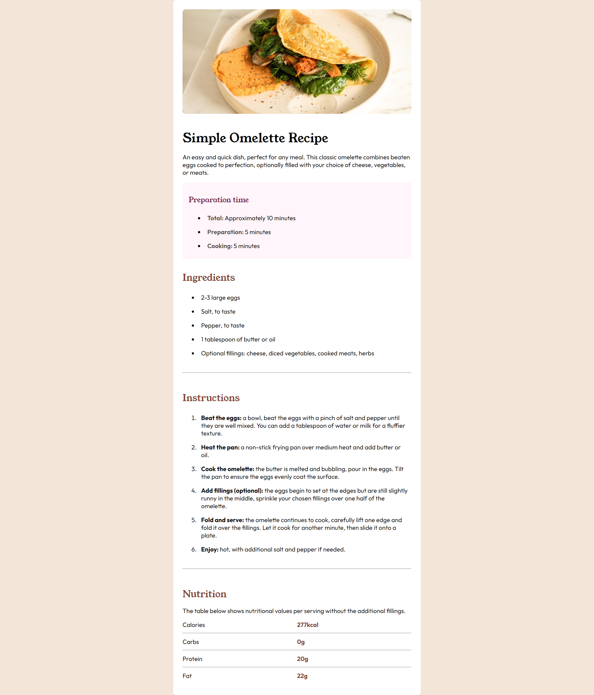

# Frontend Mentor - Recipe page solution

This is a solution to the [Recipe page challenge on Frontend Mentor](https://www.frontendmentor.io/challenges/recipe-page-KiTsR8QQKm). Frontend Mentor challenges help you improve your coding skills by building realistic projects. 

## Table of contents

- [Overview](#overview)
  - [The challenge](#the-challenge)
  - [Screenshot](#screenshot)
  - [Links](#links)
- [My process](#my-process)
  - [Built with](#built-with)
  - [Continued development](#continued-development)
- [Author](#author)

## Overview

### Screenshot

### Links

- Solution URL : [Click here!](https://github.com/Jaydev576/Recipe-Page)
- Live Site URL : [Click here!](https://jaydev576.github.io/Recipe-Page)

## My process

### Built with

- Semantic HTML5 markup
- CSS custom properties
- CSS Grid
- Mobile-first workflow

### Continued development

Other projects from Frontend Mentor!

## Author

- Name - Jaydev Parmar
- Frontend Mentor - [@Jaydev576](https://www.frontendmentor.io/profile/jaydev576)
- GitHub - [@Jaydev576](https://github.com/Jaydev576)